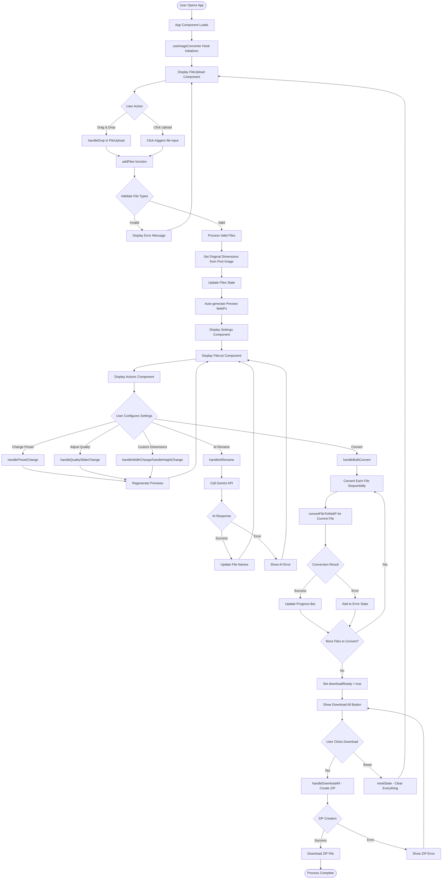

# ImageRocket - Complete Flow Chart & Component Analysis

## 🎯 Overview
This document provides a complete step-by-step flow of how the ImageRocket app works from start to finish, including all components, functions, hooks, and error handling scenarios.

---

## 🚀 Application Flow Chart



---

## 📋 Step-by-Step Breakdown

### 1. **Initial App Load**
- **Component**: `App.tsx:52-157`
- **Hook**: `useImageConverter.ts:21-50` initializes
- **What happens**:
  - ErrorBoundary wraps entire app
  - TooltipProvider enables tooltips
  - Background gradient animation starts
  - Default state: empty files array, whytes_hero preset, quality 80

### 2. **File Upload Interface**
- **Component**: `FileUpload.tsx:10-33`
- **Functions**:
  - `handleDrop:11-15` - Processes drag & drop files
  - `handleFileChange:19` - Processes clicked file selection
- **What happens**: User sees upload area with drag/drop or click functionality

### 3. **File Processing**
- **Function**: `addFiles` in `useImageConverter.ts:164-188`
- **What happens**:
  ```javascript
  // 1. Validate file types
  const validFiles = Array.from(newFiles).filter(file =>
    ['image/jpeg', 'image/png', 'image/gif', 'image/bmp'].includes(file.type)
  );

  // 2. Show error if no valid files
  if (validFiles.length === 0 && newFiles.length > 0) {
    setError(`No valid image files selected.`);
    return;
  }

  // 3. Extract dimensions from first image
  const firstImage = validFiles[0];
  const img = new Image();
  img.src = URL.createObjectURL(firstImage);
  img.onload = () => {
    setCustomWidth(img.width);
    setCustomHeight(img.height);
    setOriginalDimensions({ width: img.width, height: img.height });
  };

  // 4. Add unique files to state
  setFiles(prevFiles => {
    const existingFileNames = new Set(prevFiles.map(f => f.name));
    const uniqueNewFiles = validFiles.filter(f => !existingFileNames.has(f.name));
    return [...prevFiles, ...uniqueNewFiles];
  });
  ```

### 4. **Automatic Preview Generation**
- **Function**: `generatePreviews` in `useImageConverter.ts:65-95`
- **Trigger**: `useEffect` on files change (line 97-104)
- **What happens**:
  ```javascript
  // 1. Cancel any existing preview generation
  if (previewAbortController.current) {
    previewAbortController.current.abort();
  }

  // 2. Convert each file to WebP preview
  const previewPromises = files.map(file => {
    return convertFileToWebP(file, debouncedQuality / 100, resizeOptions, true);
  });

  // 3. Handle results with Promise.allSettled
  const results = await Promise.allSettled(previewPromises);
  const newPreviewResults = {};

  results.forEach((result, index) => {
    if (result.status === 'fulfilled' && result.value) {
      newPreviewResults[result.value.originalName] = result.value;
    }
  });
  ```

### 5. **Settings Configuration**
- **Component**: `Settings.tsx`
- **Functions**:
  - `handlePresetChange:120-126` - Changes quality preset
  - `handleQualitySliderChange:128-161` - Adjusts quality slider
  - `handleWidthChange:190-200` - Custom width input
  - `handleHeightChange:201-211` - Custom height input

### 6. **AI-Powered File Naming** (Optional)
- **Function**: `handleAiRename` in `useImageConverter.ts`
- **API**: `renameWithAi` in `aiUtils.ts`
- **What happens**:
  ```javascript
  // 1. Convert image to base64
  const base64Data = await convertFileToBase64(file);

  // 2. Call Gemini API
  const response = await fetch(`https://generativelanguage.googleapis.com/v1beta/models/gemini-1.5-flash:generateContent?key=${apiKey}`, {
    method: 'POST',
    headers: { 'Content-Type': 'application/json' },
    body: JSON.stringify({
      contents: [{
        parts: [
          { text: "Generate a descriptive filename..." },
          { inlineData: { mimeType: file.type, data: base64Data } }
        ]
      }]
    })
  });

  // 3. Extract filename from response
  const result = await response.json();
  const filename = result.candidates[0].content.parts[0].text.trim();
  ```

### 7. **Bulk Conversion Process**
- **Function**: `handleBulkConvert` in `useImageConverter.ts:231-258`
- **What happens**:
  ```javascript
  // 1. Initialize conversion state
  setIsConverting(true);
  setDownloadReady(false);
  setConversionProgress(0);

  // 2. Process each file sequentially
  for (let i = 0; i < files.length; i++) {
    const currentFile = files[i];
    setConvertingFile(currentFile.name);

    try {
      // 3. Convert file using imageUtils
      const result = await convertFileToWebP(currentFile, quality / 100, resizeOptions);
      newResults[result.originalName] = result;
      setConversionResults(prev => ({...prev, ...newResults}));
    } catch (e) {
      setError(prevError => `${prevError}\n${e.message}`);
    }

    // 4. Update progress bar
    setConversionProgress(((i + 1) / files.length) * 100);
  }

  // 5. Complete conversion
  setIsConverting(false);
  setDownloadReady(true);
  ```

### 8. **Image Conversion Core Logic**
- **Function**: `convertFileToWebP` in `imageUtils.ts:15-77`
- **What happens**:
  ```javascript
  // 1. Create image object and load file
  const img = new Image();
  img.src = URL.createObjectURL(file);

  img.onload = () => {
    // 2. Create canvas and get context
    const canvas = document.createElement('canvas');
    const ctx = canvas.getContext('2d');

    // 3. Calculate dimensions based on resize options
    let { width, height } = img;
    if (resizeOptions.maxWidth && width > resizeOptions.maxWidth) {
      height = (resizeOptions.maxWidth / width) * height;
      width = resizeOptions.maxWidth;
    }

    // 4. Draw image to canvas
    canvas.width = width;
    canvas.height = height;
    ctx.drawImage(img, 0, 0, width, height);

    // 5. Convert to WebP with quality setting
    const webpDataUrl = canvas.toDataURL('image/webp', quality);

    // 6. Calculate file size and compression ratio
    fetch(webpDataUrl)
      .then(res => res.blob())
      .then(blob => {
        const webpSize = blob.size;
        const reduction = ((originalSize - webpSize) / originalSize) * 100;
        resolve({
          originalName: file.name,
          webpDataUrl,
          originalSize: file.size,
          webpSize,
          reduction
        });
      });
  };
  ```

### 9. **Download All as ZIP**
- **Function**: `handleDownloadAll` in `useImageConverter.ts:260-285`
- **Library**: JSZip
- **What happens**:
  ```javascript
  // 1. Initialize ZIP creation
  setIsZipping(true);
  const zip = new JSZip();

  // 2. Add each converted file to ZIP
  Object.values(conversionResults).forEach(result => {
    const aiName = aiFileNames[result.originalName];
    const baseName = aiName ? aiName : result.originalName.split('.').slice(0, -1).join('.');
    const newFileName = `${baseName}.webp`;
    const base64Data = result.webpDataUrl.split(',')[1];
    zip.file(newFileName, base64Data, { base64: true });
  });

  // 3. Generate and download ZIP
  const content = await zip.generateAsync({ type: 'blob' });
  const link = document.createElement('a');
  link.href = URL.createObjectURL(content);
  link.download = 'converted_images.zip';
  link.click();
  ```

---

## ⚠️ Error Handling Scenarios

### 1. **React Error Boundary**
- **Component**: `ErrorBoundary.tsx:14-44`
- **Triggers**: Any unhandled React component errors
- **Recovery**: "Try Again" button calls `resetError()`

### 2. **File Validation Errors**
- **Location**: `useImageConverter.ts:167`
- **Triggers**:
  - Unsupported file types (not JPEG, PNG, GIF, BMP)
  - Zero valid files selected
- **Display**: Error message below upload area
- **Recovery**: User uploads valid files

### 3. **Image Loading Errors**
- **Location**: `imageUtils.ts:72-75`
- **Triggers**:
  - Corrupted image files
  - Unsupported image formats
  - Memory issues with large files
- **Handling**: Promise rejection with error message
- **Recovery**: Skip failed file, continue with others

### 4. **Canvas Context Errors**
- **Location**: `imageUtils.ts:28-30`
- **Triggers**:
  - Browser doesn't support Canvas API
  - Memory allocation failures
- **Handling**: Promise rejection
- **Recovery**: Display error, user can try smaller files

### 5. **AI Naming Errors**
- **Location**: `aiUtils.ts` API calls
- **Triggers**:
  - Invalid API key
  - Network connectivity issues
  - API rate limits
  - Large file size limits
- **Handling**: Try-catch blocks, fallback to original names
- **Recovery**: Conversion continues without AI names

### 6. **ZIP Creation Errors**
- **Location**: `useImageConverter.ts:275-283`
- **Triggers**:
  - JSZip library not loaded
  - Memory issues with large files
  - Browser storage limits
- **Handling**: Error state display
- **Recovery**: User can download individual files

### 7. **Conversion Progress Errors**
- **Location**: `useImageConverter.ts:248-251`
- **Triggers**: Individual file conversion failures
- **Handling**: Accumulate error messages, continue with remaining files
- **Display**: Error messages shown to user
- **Recovery**: Partial success - download successfully converted files

### 8. **Memory Management**
- **Location**: Throughout `imageUtils.ts` and `useImageConverter.ts`
- **Handling**:
  - `URL.revokeObjectURL()` to free memory
  - `AbortController` for canceling operations
  - Cleanup in `useEffect` return functions

---

## 🔄 State Management Summary

### Core States in `useImageConverter.ts`:
- **Files**: `files[]` - Array of uploaded File objects
- **Conversion Results**: `conversionResults{}` - Final WebP conversion data
- **Preview Results**: `previewResults{}` - Live preview data for settings
- **AI Names**: `aiFileNames{}` - AI-generated filenames
- **Progress Tracking**: `isConverting`, `conversionProgress`, `convertingFile`
- **Settings**: `selectedPreset`, `quality`, `customWidth`, `customHeight`
- **Error Handling**: `error` - Accumulated error messages
- **Download State**: `downloadReady`, `isZipping`

### Key Performance Optimizations:
- **Debounced inputs** with `useDebounce` hook
- **Memoized calculations** with `useMemo` for resize options
- **Abort controllers** for canceling preview generation
- **Sequential conversion** to prevent memory overload
- **Proper cleanup** of object URLs and timers

---

## 🎨 Component Tree Structure

```
App.tsx
├── ErrorBoundary.tsx
├── TooltipProvider
├── Background Animation (CSS)
└── Card
    ├── CardHeader
    │   ├── CardTitle
    │   └── CardDescription
    └── CardContent
        ├── FileUpload.tsx
        ├── Error Display (conditional)
        └── Conversion Interface (conditional)
            ├── Settings.tsx
            ├── Progress.tsx (when converting)
            ├── FileList.tsx
            │   └── FileItem.tsx (for each file)
            └── Actions.tsx
```

This flow chart provides a complete understanding of how your ImageRocket app processes images from upload to download, including all error scenarios and recovery mechanisms.